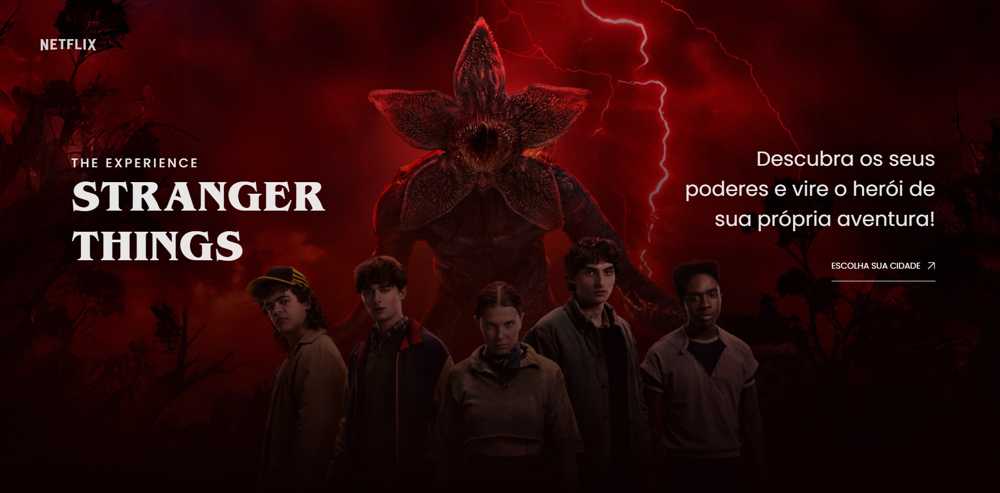

<h1 align="center">DevArt - Stranger Things </h1>

Projeto DevArt do Gustavo Campelo, sobre a 5ª temporada de Stranger Things, feito para aprender sobre desenvolvimento web.

  <a href="#-tecnologias">Tecnologias</a>&nbsp;&nbsp;&nbsp;|&nbsp;&nbsp;&nbsp;
  <a href="#-projeto">Projeto</a>

  
 

## 🚀 Tecnologias

Esse projeto foi desenvolvido com as seguintes tecnologias:

- Figma
- HTML e CSS
- JavaScript
- GSAP
- Git e Github

## 💻 Projeto

- Landing page da atração "Stranger Things: The Experience" (Netflix x Fever), com identidade visual sombria e cinematográfica, totalmente responsiva.
- Animações de scroll e texto feitas com GSAP (ScrollSmoother, ScrollTrigger e SplitText).

<h2 align="center">📌 Desenvolvedores</h2>

<table align="center">
  <tr>
    <td align="center">
      <a href="https://github.com/rebellatoGui" title="GitHub">
         
        
          <b>Guilherme Rebellato</b>
        
      </a>
    </td>
  </tr>
</table>

 

---

Feito com ♥ por Guilherme 

